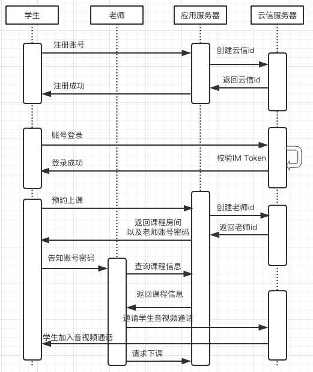
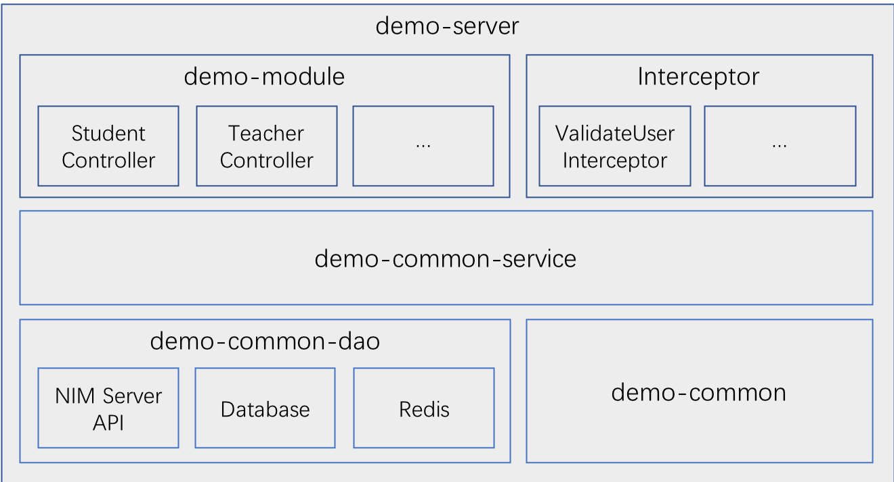

# 网易云信音乐教学Demo Server实现说明

## 1 概述
### 1.1 服务器业务说明
音乐教学demo应用服务器维护课程信息，即为注册学生账号创建课程、分配老师。为了简化业务场景，凸显云信能力，应用服务器对交互流程进行了相应删减，只包含**学生账号注册**、**学生预约上课**、**查询课程信息**以及**老师下课**相关逻辑，老师账号由应用服务器自动创建，学生与老师的对应关系由应用服务器在学生预约上课时指定。

业务主流程示意图如下所示：



业务场景如下：

1. 学生注册账号  
	应用服务器使用学生注册时填写的账号到云信服务器创建对应云信id。
1. 账号登录  
	为了简化登录流程，账号注册时，服务器与客户端约定，将注册密码md5加密（32位小写）过后的密文设置为云信id的token值，这样客户端在登录时只要将用户输入的密码进行md5加密，到云信服务器校验token即可完成登录，不需要与应用服务器交互。
1. 学生预约上课  
	学生登录后，向应用服务器发起预约上课请求，这时应用服务器会创建一个老师账号分配给这次课程，并将老师的账号、密码与课程房间信息一起返回给学生。同样，老师账号对应云信id的token也约定为密码md5加密过后的密文，这样客户端拿到老师账号密码也可以进行登录。
1. 老师与学生上课  
	老师账号登录后，可以通过应用服务器查询对应课程学生账号，这时候老师与学生即可以通过云信服务器音视频通话开始上课。简化场景下，应用服务器并不对老师和学生的通话进行控制，如果业务需要可以自己实现。课程结束后，老师请求下课，应用服务器会解除课程对应关系
	

## 2 工程架构
### 2.1 技术框架
+ 项目依赖管理 Maven
+ Spring MVC 4.2.9.RELEASE
+ Spring Session 1.2.2.RELEASE
+ 数据库持久层框架 Mybatis 3.4.4
+ redis客户端 Redisson 1.2.1
+ Java Bean映射框架 Mapstruct 1.1.0.Final
+ Json处理框架 Fastjson 1.2.33
+ 日志框架 Slf4j 1.7.25 + Logback 1.2.3

### 2.2 逻辑架构


+ demo-server 模块，工程部署入口，包含IP拦截器、工程配置文件定义、全局异常处理等
+ demo-module 模块，对外接口定义，分为用户注册和账号检查，学生操作，老师操作相关三部分
+ demo-common-service 模块，业务逻辑实现层
+ demo-common-dao 模块，数据依赖，包含云信Api调用，数据库和缓存调用
+ demo-common 模块，工程常量定义以及工具类实现

## 3 部署说明
### 3.1 前置条件
#### 3.1.1 Mysql数据库配置  
数据库配置完成后，需要确定如下配置：

+ 数据库地址：假设为`127.0.0.1:3306`
+ 数据库名称：默认设置为`appdemo`
+ 数据用户名：默认设置为`demouser`
+ 数据库密码：默认设置为`demopass`
+ 创建数据表：`demo_seq`、`demo_music_student`、`demo_music_teacher`、`demo_music_room`
	
具体操作如下：
	
+ 确保已安装Mysql数据库（推荐版本5.5+）  
+ 创建数据库以及数据库用户（如果已有配置，可跳过，直接进行下一步）  
	
	``` 
	# 创建数据库，数据库名称可自定义
	CREATE DATABASE `appdemo` DEFAULT CHARACTER SET utf8 COLLATE utf8_general_ci;
	
	# 创建数据库用户
	CREATE USER 'demouser'@'%' IDENTIFIED BY 'demopass';
	
	# 赋予用户数据库操作权限
	GRANT ALL ON appdemo.* TO 'demouser'@'%';
	```
	**注意：为了简化和统一配置，数据库用户host设置为'%'，并且赋予了appdemo库的所有权限，安全级别较低，生产环境请自定义配置**
+ 创建数据表
	
	```
	# 建表语句
	use appdemo;
	
	# 全局递增序列号表，当前用于生成唯一游客id
	CREATE TABLE `demo_seq` (
	  `id` bigint(11) unsigned NOT NULL AUTO_INCREMENT,
	  PRIMARY KEY (`id`)
	) ENGINE=InnoDB AUTO_INCREMENT=10000 DEFAULT CHARSET=utf8 COMMENT='全局递增序列号表';
	
	# 学生账号表
	CREATE TABLE `demo_music_student` (
	  `id` bigint(20) unsigned NOT NULL AUTO_INCREMENT COMMENT '主键ID',
	  `accid` varchar(64) NOT NULL COMMENT '用户账号',
	  `nickname` varchar(64) NOT NULL COMMENT '用户昵称',
	  `password` varchar(64) NOT NULL COMMENT '密码',
	  `im_token` varchar(64) NOT NULL DEFAULT '' COMMENT 'im token',
	  `created_at` timestamp NOT NULL DEFAULT '2018-01-01 00:00:00' COMMENT '创建时间',
	  `updated_at` timestamp NOT NULL DEFAULT CURRENT_TIMESTAMP ON UPDATE CURRENT_TIMESTAMP COMMENT '更新时间',
	  PRIMARY KEY (`id`),
	  UNIQUE KEY `uk_accid` (`accid`)
	) ENGINE=InnoDB AUTO_INCREMENT=5141 DEFAULT CHARSET=utf8mb4 COMMENT='音乐教学demo学生信息表';

	# 老师账号表
	CREATE TABLE `demo_music_teacher` (
	  `id` bigint(20) unsigned NOT NULL AUTO_INCREMENT COMMENT '主键ID',
	  `accid` varchar(64) NOT NULL COMMENT '用户账号',
	  `nickname` varchar(64) NOT NULL COMMENT '用户昵称',
	  `password` varchar(64) NOT NULL COMMENT '密码',
	  `im_token` varchar(64) NOT NULL DEFAULT '' COMMENT 'im token',
	  `created_at` timestamp NOT NULL DEFAULT '2018-01-01 00:00:00' COMMENT '创建时间',
	  `updated_at` timestamp NOT NULL DEFAULT CURRENT_TIMESTAMP ON UPDATE CURRENT_TIMESTAMP COMMENT '更新时间',
	  PRIMARY KEY (`id`),
	  UNIQUE KEY `uk_accid` (`accid`)
	) ENGINE=InnoDB AUTO_INCREMENT=5315 DEFAULT CHARSET=utf8mb4 COMMENT='音乐教学demo老师信息表';
	
	# 课程房间信息表
	CREATE TABLE `demo_music_room` (
	  `id` bigint(20) unsigned NOT NULL AUTO_INCREMENT COMMENT '主键ID',
	  `name` varchar(64) DEFAULT NULL COMMENT '房间名称',
	  `status` tinyint(4) NOT NULL DEFAULT '0' COMMENT '房间状态，0-初始状态，1-已下课',
	  `teacher_accid` varchar(64) NOT NULL COMMENT '老师账号',
	  `student_accid` varchar(64) NOT NULL COMMENT '学生账号',
	  `expired_at` bigint(20) NOT NULL DEFAULT '0' COMMENT '课程失效时间',
	  `created_at` timestamp NOT NULL DEFAULT '2018-01-01 00:00:00' COMMENT '创建时间',
	  `updated_at` timestamp NOT NULL DEFAULT CURRENT_TIMESTAMP ON UPDATE CURRENT_TIMESTAMP COMMENT '更新时间',
	  PRIMARY KEY (`id`),
	  KEY `idx_teacher_expired_at` (`teacher_accid`,`expired_at`),
	  KEY `idx_student_expired_at` (`student_accid`,`expired_at`)
	) ENGINE=InnoDB AUTO_INCREMENT=10000 DEFAULT CHARSET=utf8mb4 COMMENT='音乐教学demo房间信息表';
	```
	
#### 3.1.2 Redis配置  
确定redis配置信息：

+ redis地址：假设为`127.0.0.1:6379`
+ redis密码：假设未设置密码

#### 3.1.3 云信App配置  
从[云信控制台](https://app.netease.im/index#/)获取应用信息，假设为：

+ `App Key: bc01d41ebc78d6v5kn23a83d33f08n9c`
+ `App Secret: cl2k6c7p3xh0`
	
确保应用开通以下功能：  
	
+ 互动直播
+ 教学白板

#### 3.1.4 Maven配置
确保服务器已安装 Maven  
执行 `mvn -v`命令能看到 maven相关信息输出

```
$ mvn -v
Apache Maven...
Maven home...
```

### 3.2 工程配置
配置文件根据环境不同，位于不同的路径下，部署时通过指定 Maven Profile 属性，使用指定环境的配置文件。目前已有配置文件的路径如下，其中`dev`表示开发环境，`test`表示测试环境，`pre`表示预发步环境，`prod`表示线上生产环境。相关的Maven配置位于工程目录`demo-server/pom.xml`文件的`profiles`节点中，默认启用开发环境`dev`。

```
demo-server/src/main/resources/profile
├── dev
│   ├── config.properties
│   ├── db.properties
│   └── logback.xml
├── pre
│   ├── config.properties
│   ├── db.properties
│   └── logback.xml
├── prod
│   ├── config.properties
│   ├── db.properties
│   └── logback.xml
└── test
    ├── config.properties
    ├── db.properties
    └── logback.xml
```

+ `config.properties`文件配置
	- 云信服务端api接口地址配置：`nim.server.api.url=https://api.netease.im/nimserver/`
	- 视频云直播api接口地址配置：`vcloud.server.api.url=https://vcloud.163.com/`
	- AppKey配置：`appkey=bc01d41ebc78d6v5kn23a83d33f08n9c`
	- AppSecret配置：`cl2k6c7p3xh0`
+ `db.properties`文件配置
	- Mysql配置  
	
		```
		mysql.driver=com.mysql.jdbc.Driver
		mysql.url=jdbc:mysql://127.0.0.1:3306/appdemo?useUnicode=true&characterEncoding=utf-8&allowMultiQueries=true
		mysql.user=demouser
		mysql.pwd=demopass
		```
	- Redis配置
	
		```
		redis.ip=127.0.0.1
		redis.port=6379
		redis.password=
		```
+ `logback.xml`文件配置
	- 指定工程日志路径  
		默认配置为：`<property name="log.dir" scope="context" value="${catalina.home}/logs"/>`
		可以根据需要自定义工程日志路径
		
### 3.3 项目部署

+ 通过war包部署  
	切换到工程根目录下，执行以下操作：
	
	```
	# 从父工程打包，使用开发环境配置文件，跳过单元测试
	$ mvn clean install -Pdev -Dmaven.test.skip=true
	```
	打包成功后，会生成war包 `demo-server/target/appdemo.war`  
	接下来就可以将war包发布到已有tomcat的`webapps`目录下进行部署
+ 直接通过`maven tomcat`插件部署  
	项目父工程`pom.xml`文件中已经定义好了插件配置，默认部署到tomcat根目录下，并指定端口`8081`。
	
	```
    <plugin>
        <groupId>org.apache.tomcat.maven</groupId>
        <artifactId>tomcat7-maven-plugin</artifactId>
        <version>2.1</version>
        <configuration>
            <path>/</path>
            <port>8081</port>
            <charset>UTF-8</charset>
            <uriEncoding>UTF8</uriEncoding>
        </configuration>
    </plugin>
	```
	切换到工程根目录下，执行以下操作：
	
	```
	# 从父工程打包，使用开发环境配置文件，跳过单元测试
	$ mvn clean install -Pdev -Dmaven.test.skip=true
	
	# 切换到 demo-server 模块
	$ cd demo-server
	
	# 通过tomcat插件启动
	$ mvn tomcat7:run
	```

## 4 接口描述
### 4.1 接口概述

#### 4.1.1 接口地址说明
根据部署方式以及部署服务器的不同，娃娃机应用服务器的接口地址会有变更，因此后续接口描述中，以`${Host}`代替地址前缀，可以根据实际情况进行替换，例如：

+ 直接访问服务器  
	此时，假设服务器地址为`127.0.0.1`，tomcat部署端口为`8081`，工程映射到tomcat访问根目录，则 `${Host}=http://127.0.0.1:8081`
+ 通过nginx代理  
	假设nginx配置为：
	
	```
	server {
		listen		80;
		server_name	myserver.com
		
		location / {
			# 转发到实际部署地址
			proxy_pass http://127.0.0.1:8081;
		}
	}
	```
	则`${Host}=http://myserver.com`

#### 4.1.2 接口返回值说明

所有接口返回类型为**JSON**。返回字段含义如下：

|名称	|类型	|说明    |
|:------|:-----:| :-----|
|code	|Int	|返回结果的状态码|
|msg	|String	|返回code非200时包含的错误信息|
|data	|String	|返回的结果集|
|data.list  |JsonArray | 用于返回列表结果|
|data.total| Int | 用于返回列表结果的总数|

### 4.2 账号相关接口 
#### 4.2.1 学生账号注册
+ 接口说明  
	学生账号注册
+ 请求说明

	```
	POST http://${Host}/music/user/reg HTTP/1.1
	Content-Type: application/x-www-form-urlencoded;charset=utf-8
	```
+ 参数说明

	|名称	|类型	|说明    |必须|
	|:------|:-----:| :-----|:---:|
	|accid|String| 注册账号|是|
	|nickname|String| 昵称|是|
	|password|String| 密码md5加密过后的密文，32位|是|

+ 返回说明  
	http 响应：**JSON**
	
	|参数	|类型|	说明|
	|:------|:-----:| :-----|
	|accid| String| 注册账号|
	|nickname|String| 昵称|是|
	|imToken|String| 对应云信id的token值|是|
	
	```
	"Content-Type": "application/json; charset=utf-8"
	//成功结果示例
	{
	  "code": 200,
	  "data": {
	    "accid": "student111",
	    "nickname": "www",
	    "imToken": "25d55ad283aa400af464c76d713c07ad"
	  }
	} 
	
	//失败结果示例
	{
	    "code": 906,
	    "msg":"用户已注册"
	}
	```
+ 响应状态码  
	400、500、900、901、902、903、906  
	具体请参考 [错误码表](error_code.md)

#### 4.2.2 账号检查
+ 接口说明  
	检查制定账号信息，返回账号类型
+ 请求说明

	```
	POST http://${Host}/music/user/check HTTP/1.1
	Content-Type: application/x-www-form-urlencoded;charset=utf-8
	```
+ 参数说明

	|名称	|类型	|说明    |必须|
	|:------|:-----:| :-----|:---:|
	|accid|String| 需要检查的账号信息 |是|
	
+ 返回说明  
	http 响应：**JSON**
	
	|参数	|类型|	说明|
	|:------|:-----:| :-----|
	|accid| String| 检查的账号|
	|userType| int| 账号类型，0-学生，1-老师|
	
	```
	"Content-Type": "application/json; charset=utf-8"
	//成功结果示例
	{
	  "code": 200,
	  "data": {
	    "accid": "student111",
	    "userType": 0 // 0-学生，1-老师
	  }
	} 

	//失败结果示例
	{
	  "code": 904,
	  "msg": "账号不存在"
	}
	```
+ 响应状态码  
	400、500、904   
	具体请参考 [错误码表](error_code.md)
	
### 4.3 学生调用接口
#### 4.3.1 查询课程信息
+ 接口说明  
	查询当前课程信息，如果已有课程信息，继续当前课程，否则可以预约新课程
+ 请求说明

	```
	POST http://${Host}/music/room/query HTTP/1.1
	Content-Type: application/x-www-form-urlencoded;charset=utf-8
	```
+ 参数说明

	|名称	|类型	|说明    |必须|
	|:------|:-----:| :-----|:---:|
	|sid|String| 当前登录学生的accid|是|
+ 返回说明  
	http 响应：**JSON**
	
	|参数	|类型|	说明|
	|:------|:-----:| :-----|	
	|roomId|String|课程房间id|
	|teacherAccid|String|老师账号|
	|teacherName|String|老师昵称|
	|teacherPassword|String|老师密码|
	|studentAccid|String|学生账号|
	|studentName|String|学生昵称|
		
	```
	"Content-Type": "application/json; charset=utf-8"
	//成功结果示例
	{
	    "code": 200,
	    "data": {
	        "total": 1,
	        "list": [
	            {
	                "roomId": 10003,
	                "teacherAccid": "t11313542",
	                "teacherName": "老师215329",
	                "teacherPassword": "123456",
	                "studentAccid": "student111",
	                "studentName": "www"
	            }
	        ]
	    }
	}
	 
	// 失败结果示例
	{
	  "code": 401,
	  "msg": "用户校验失败"
	}
	```
+ 响应状态码  
	400、401、500  
	具体请参考 [错误码表](error_code.md) 
	
#### 4.3.2 学生预约上课
+ 接口说明  
	学生预约新课程
+ 请求说明

	```
	POST http://${Host}/music/room/create HTTP/1.1
	Content-Type: application/x-www-form-urlencoded;charset=utf-8
	```
+ 参数说明

	|名称	|类型	|说明    |必须|
	|:------|:-----:| :-----|:---:|
	|sid|String| 当前登录学生的accid|是|
+ 返回说明  
	http 响应：**JSON**
	
	|参数	|类型|	说明|
	|:------|:-----:| :-----|	
	|roomId|String|课程房间id|
	|teacherAccid|String|老师账号|
	|teacherName|String|老师昵称|
	|teacherPassword|String|老师密码|
	|studentAccid|String|学生账号|
	|studentName|String|学生昵称|
		
	```
	"Content-Type": "application/json; charset=utf-8"
	//成功结果示例
	{
	    "code": 200,
	    "data": {
	        "roomId": 10003,
	        "teacherAccid": "t11313542",
	        "teacherName": "老师215329",
	        "teacherPassword": "123456",
	        "studentAccid": "student111",
	        "studentName": "www"
	    }
	}
	//失败结果示例
	{
	    "code":807,
	    "msg":"房间数量限制"
	}
	```
+ 响应状态码  
	400、401、500、807  
	具体请参考 [错误码表](error_code.md)

### 4.4 老师调用接口
#### 4.4.1 查询课程信息
+ 接口说明  
	查询当前老师对应课程信息
+ 请求说明

	```
	POST http://${Host}/music/teacher/room/query HTTP/1.1
	Content-Type: application/x-www-form-urlencoded;charset=utf-8
	```
+ 参数说明

	|名称	|类型	|说明    |必须|
	|:------|:-----:| :-----|:---:|
	|sid|String| 当前登录老师的accid|是|
+ 返回说明  
	http 响应：**JSON**
	
	|参数	|类型|	说明|
	|:------|:-----:| :-----|	
	|roomId|String|课程房间id|
	|teacherAccid|String|老师账号|
	|teacherName|String|老师昵称|
	|studentAccid|String|学生账号|
	|studentName|String|学生昵称|
		
	```
	"Content-Type": "application/json; charset=utf-8"
	//成功结果示例
	{
	    "code": 200,
	    "data": {
	        "total": 1,
	        "list": [
	            {
	                "roomId": 10003,
	                "teacherAccid": "t11313542",
	                "teacherName": "老师215329",
	                "studentAccid": "student111",
	                "studentName": "www"
	            }
	        ]
	    }
	}
	 
	// 失败结果示例
	{
	  "code": 401,
	  "msg": "用户校验失败"
	}
	```
+ 响应状态码  
	400、401、500  
	具体请参考 [错误码表](error_code.md)

#### 4.4.2 老师下课
+ 接口说明  
	课程结束后，老师请求下课，解除房间绑定关系
+ 请求说明

	```
	POST http://${Host}/music/teacher/room/close HTTP/1.1
	Content-Type: application/x-www-form-urlencoded;charset=utf-8
	```
+ 参数说明

	|名称	|类型	|说明    |必须|
	|:------|:-----:| :-----|:---:|
	|sid|	String| 当前登录老师的accid|否|
	|roomId|	String| 指定下课的房间id|否|

+ 返回说明  
	http 响应：**JSON**
		
	```
	//成功结果示例
	"Content-Type": "application/json; charset=utf-8"
	{
	    "code":200
	}
	
	//失败结果示例
	{
	    "code":804,
	    "msg":"房间不存在"
	}
	```
+ 响应状态码  
	400、500、804  
	具体请参考 [错误码表](error_code.md) 
